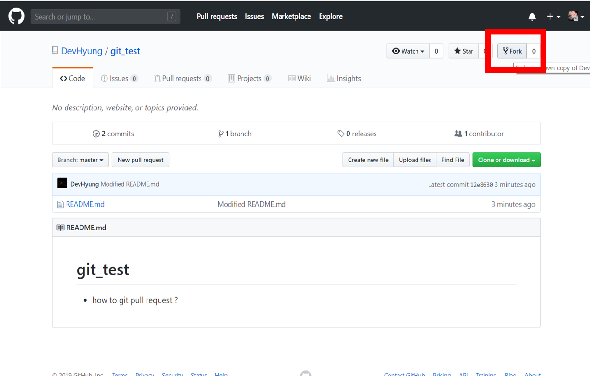
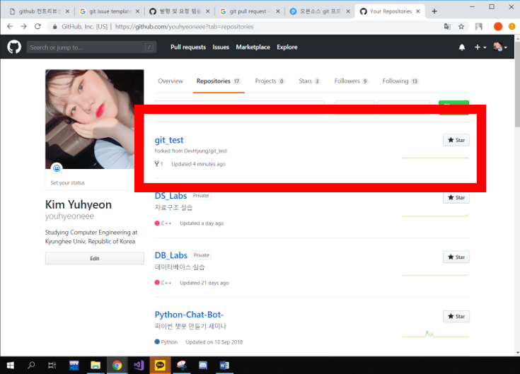
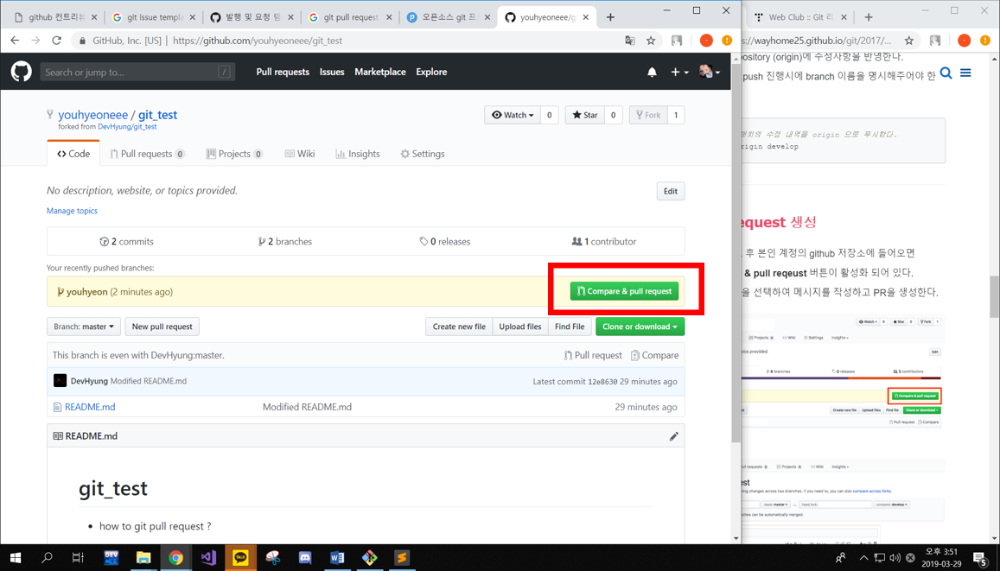

# git_test

+ how to git pull request ? 

## 1. Fork

+ 타겟 프로젝트의 저장소를 자신의 저장소로 Fork



## 2. clone, remote 설정

+ Fork한 저장소를 로컬에 clone한다.
```
$ git clone 'https://github.com/youhyeoneee/git_test.git'
```

+ 로컬 저장소에 원격 저장소를 추가한다. 

	- 원본 프로젝트 저장소 (직접 추가 필요)
	- fork한 로컬 프로젝트 (clone을 하면 기본적으로 origin이라는 별명으로 추가되어있다.)

```
#원본 프로젝트 저장소를 원격 저장소로 추가
$ git remote add hyeong(별명) https://github.com/DevHyung/git_test

#원격 저장소 설정 현황 확인 
$ git remote -v

hyeong  https://github.com/DevHyung/git_test (fetch)
hyeong  https://github.com/DevHyung/git_test (push)
origin  https://github.com/youhyeoneee/git_test.git (fetch)
origin  https://github.com/youhyeoneee/git_test.git (push)

```

## 3. branch 생성 

+ 자신의 로컬 컴퓨터에서 코드를 추가하는 작업은 branch를 만들어서 진행한다.

```
# youhyeon 이라는 이름의 branch를 생성한다.
$ git checkout -b youhyeon
Switched to a new branch 'youhyeon'

# 이제 2개의 브랜치가 존재한다. 
$ git branch
  master
* youhyeon

```

## 4. 수정 작업 후 add, commit, push

+ 수정 사항을 add, commit, push를 통해서 자신의 guthub repository(origin)에 반영한다.

+ **주의사항** puch 진행시에 branch 이름을 명시해주어야 한다.
```
# youhyeon 브랜치의 수정 내역을 origin으로 푸시한다.
$ git push origin youhyeon
``` 

## 5. Pull Request 생성

+ push 완료 후 본인 계정의 github 저장소에 들어오면 **Compare & pull request** 버튼이 활성화 되어있다.


+ 해당 버튼을 선택하여 메시지를 작성하고 PR을 생성한다. 

## 6. 코드리뷰, Merge Pull Request

+ PR을 받은 원본 저장소 관리자는 코드 변경 내역을 확인하고 Merge 여부를 결정한다.

## 7. Merge 이후 동기화 및 branch 삭제

+ 원본 저장소에 Merge가 완료되면 로컬 코드와 원본 저장소의 코드를 동기화한다. 

+ 작업하던 로컬의 branch를 삭제한다. 

```
#코드 동기화
$ git pull hyeong

#브랜치 삭제 
$ git branch -d youhyeon
```
+ 나중에 추가로 작업할 일이 있다면 **git pull hyeong(remote 별명)** 명령을 통해 
  원본 저장소와 동기화를 진행하고 3~7을 반복한다. 


## 출처 : https://wayhome25.github.io/git/2017/07/08/git-first-pull-request-story/
