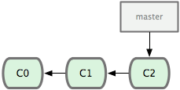
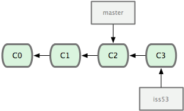
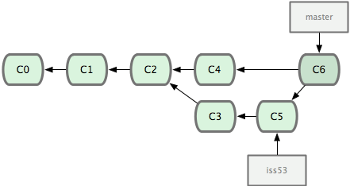

## 💡 Intro
Git Branch 관련된 자료 

___
## 💡 Index

👉 Branch Fast-Forward

👉 3-way Merge

👉 Tag

👉 Commit modify 
___
## 💡 Branch Fast-Forward

먼저 커밋을 몇 번 했다고 가정하자.



```bash
$ git checkout -b iss53
Switched to a new branch 'iss53'
```


```bash
$ vim index.html
$ git commit -a -m 'added a new footer [issue 53]'
```


```bash
$ git checkout master
Switched to branch 'master'

$ git checkout -b hotfix
Switched to a new branch 'hotfix'
$ vim index.html
$ git commit -a -m 'fixed the broken email address'
[hotfix 3a0874c] fixed the broken email address
 1 files changed, 1 deletion(-)
```


```bash
$ git checkout master
$ git merge hotfix
Updating f42c576..3a0874c
Fast-forward
 README | 1 -
 1 file changed, 1 deletion(-)
```


```bash
$ git branch -d hotfix
Deleted branch hotfix (was 3a0874c).

$ git checkout iss53
Switched to branch 'iss53'
$ vim index.html
$ git commit -a -m 'finished the new footer [issue 53]'
[iss53 ad82d7a] finished the new footer [issue 53]
 1 file changed, 1 insertion(+)
```

___

## 💡 3-Way Merge

```bash
$ git checkout master
$ git merge iss53
Auto-merging README
Merge made by the 'recursive' strategy.
 README | 1 +
 1 file changed, 1 insertion(+)
```


그후에


충돌나는경우

```bash
$ git merge iss53
Auto-merging index.html
CONFLICT (content): Merge conflict in index.html
Automatic merge failed; fix conflicts and then commit the result.

$ git status
On branch master
You have unmerged paths.
  (fix conflicts and run "git commit")

Unmerged paths:
  (use "git add <file>..." to mark resolution)

        both modified:      index.html

no changes added to commit (use "git add" and/or "git commit -a")

<<<<<<< HEAD
<div id='footer'>contact : email.support@github.com</div>
=======
<div id='footer'>
  please contact us at support@github.com
</div>
>>>>>>> iss53
```
아니면 gitmergetool 이용 
```bash
$ git mergetool
```
___

## 💡 Tag

기본 태그 만들기 
```bash
$ git tag apple

$ git tag
apple

$ git log --decorate
commit e7978c94d2104e3e0e6e4a5b4a8467b1d2a2ba19 (HEAD, tag: apple, master)
Author: yourname <yourname@yourmail.com>
Date:   Wed Jul 18 16:43:27 2012 +0900

    first commit
```

태그에 메세지 달기 
```bash
$ git tag -am "누구나 쉽게 이해할 수 있는 Git 입문" banana

$ git tag -n
apple           first commit
banana          누구나 쉽게 이해할 수 있는 Git 입문

```
태그삭제하기
```bash
$ git tag -d <tagname>
```
___

## 💡 Ref Link
* [누구나 쉽게 이해할수있는 Git 입문](https://backlog.com/git-tutorial/kr/stepup/stepup1_1.html)
* [Git-scm](https://git-scm.com/book/ko/v1/Git-%EB%B8%8C%EB%9E%9C%EC%B9%98-%EB%B8%8C%EB%9E%9C%EC%B9%98%EC%99%80-Merge%EC%9D%98-%EA%B8%B0%EC%B4%88)

