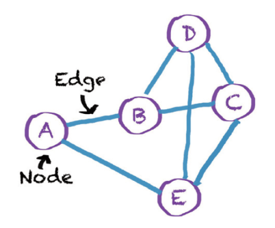

## 💡 Intro : TensorFlow 란?

+ TensorFlow is an open source software library for numeriacl computation using data flow graphs.

+ Python 환경에 최적화 

+ TensorFlow의 장점 

  1. 전세계적으로 활발한 커뮤니티
  2. 텐서보드를 이용한 편리한 시각화 
  3. 단일 데스크톱, 대량의 서버 클러스터, 모바일 디바이스까지 지원하는 광범위한 이식성
  4. Keras, TF-Slim 등 다양한 추상화 라이브러리와 혼용해서 사용 가능 

___

## Hello TensorFlow!
```
import tensorflow as tf

#Create a constant op 
#this op is added as a node to the default graph
hello = tf.constant('Hello, TendorFlow!')

#seart a TF session
sess = tf.Session()

#run the op and get result 
print(sess.run(hello))

```
>>> b'Hello, TendorFlow!' (b는 Byte literals를 나타낸다.)
 
 +  tensorflow constant라는 노드를 하나 만들고 session을 만든 다음에 노드를 실행 시켰다! 

___

## Computational Graph

+ TensorFlow란 텐서(tensor, 다차원 배열)를 흘려보내면서(flow) 데이터를 처리하는 라이브러리 

### Tensor의 예시 
+ 3 #랭크 0 텐서 ; shape [] 스칼라
+ [1., 2., 3.] #랭크 1 텐서 ; shape[3] 벡터
+ [[1., 2., 3.], [4., 5., 6.]] #랭크 2 텐서 ; shape [2, 3] 행렬
+ [[[1., 2., 3.]], [[7., 8., 9.]]] #랭크 3 텐서 ; shape [1, 2, 3]

+ 랭크(Rank) = 텐서의 차원(Dimension). 
  0 : 스칼라, 1 : 벡터, 2 : 행렬, 3 이상 : 텐서  


+ 이런 텐서들은 계산 그래프 구조(Computational Graph)를 통해 노드에서 노드로 이동(Flow)한다. 텐서플로우 라이브러리는 텐서들을 흘려보내는 그래프 구조를 먼저 정의하고, 정의한 그래프에 실제 텐서들을 흘려보내주도록 디자인 되었다. 따라서 텐서플로를 이용해서 프로그램을 작성할 때는 반드시 다음 과정을 거쳐야 한다.

1. 그래프 생성
2. 그래프 실행 

### 그래프 생성 

그래프 생성 단계에서는 연산 과정을 그래프 형태로 표현한다. 

컴퓨터 공학에서 정의하는 그래프 : 노드(Node)와 엣지(Edge)로 이루어진 자료구조
